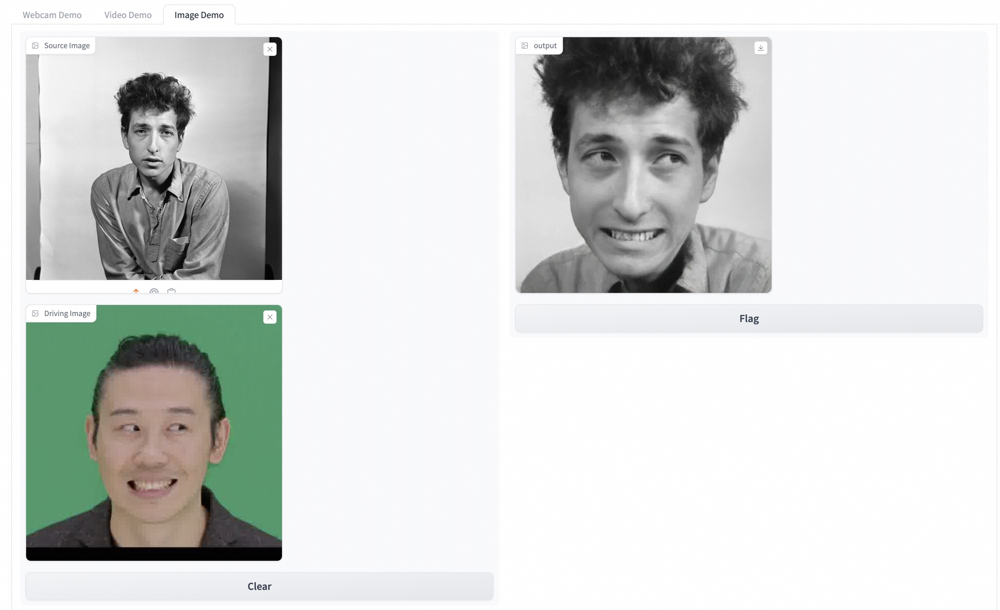

# 🎭 mimic_head 


🚀 **Unofficial One-click Version of LivePortrait** with Webcam Support!

## 🌟 Features
- 📷 **Webcam, Video, and Single Image Support**:
  - Easily switch between different input modes to suit your needs.
- 🖥️ **CPU, MPS, and CUDA Backend Support**:
  - Run seamlessly without needing an Nvidia GPU!

## 📸 Screenshot
### Image Mode:


### Video Mode:
https://github.com/user-attachments/assets/1aef9ae6-7d05-4fea-a03c-2c3de76df8b1

### Webcam Mode:
**Note: FPS ~ 13 on a Mac laptop with noticeable delay.**

https://github.com/user-attachments/assets/6a2ce4c5-e3f2-40cd-9fe9-c081407aaca1


## 🚀 Getting Started

### 📦 Installation
To install and use `mimic_head`, simply run the following command:

```bash
pip install mimic_head
```

### 🛠️ Usage
Once installed, you can start the application by running:

```bash
mimic_head run
```

## 📚 Documentation

For detailed instructions and advanced usage, please refer to our [README](https://github.com/vra/mimic_head).

## 🤝 Contributing
We welcome contributions! If you'd like to contribute, please fork the repository and use a feature branch. Pull requests are warmly welcomed.

1. Fork the Project
2. Create your Feature Branch (`git checkout -b feature/AmazingFeature`)
3. Commit your Changes (`git commit -m 'Add some AmazingFeature'`)
4. Push to the Branch (`git push origin feature/AmazingFeature`)
5. Open a Pull Request

## 🛡️ License
This project is licensed under the MIT License - see the [LICENSE](LICENSE) file for details.

## 💬 Contact
For any inquiries, questions, or issues, please open an issue in this repository or contact me at <wyf.brz@gmail.com>.

## 📝 Acknowledgments
- Special thanks to the original creators of LivePortrait for their work.
- Inspired by the amazing community contributions and ideas.

## ⭐ Support
If you like this project, please give it a ⭐ on [GitHub](https://github.com/vra/mimic_head)!

---

Made with ❤️ by [Yunfeng Wang](https://github.com/vra).
